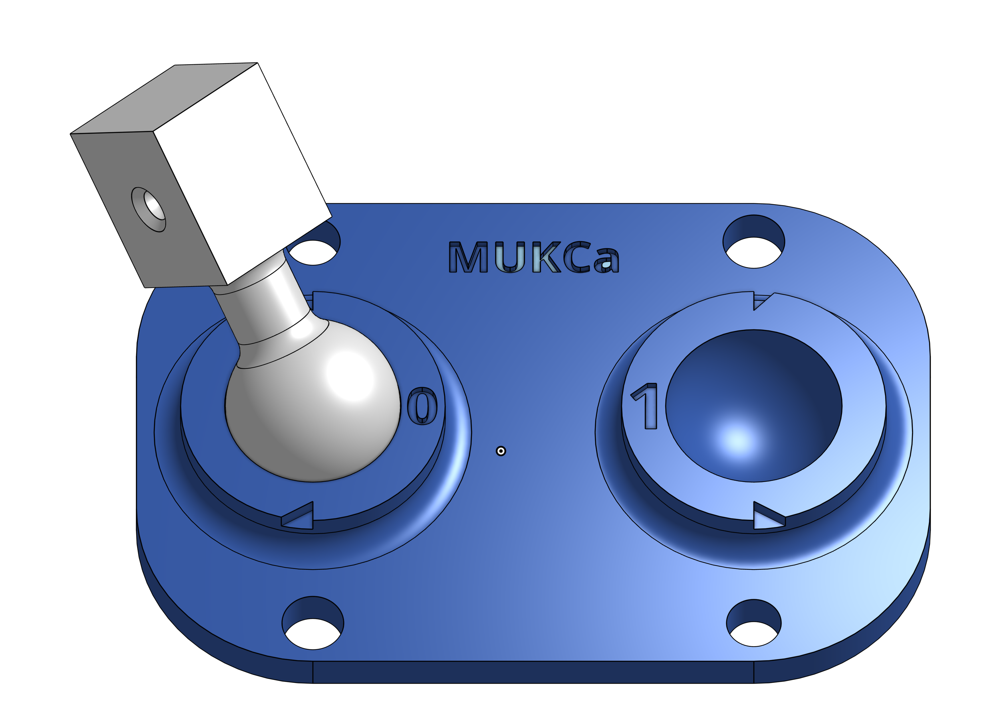
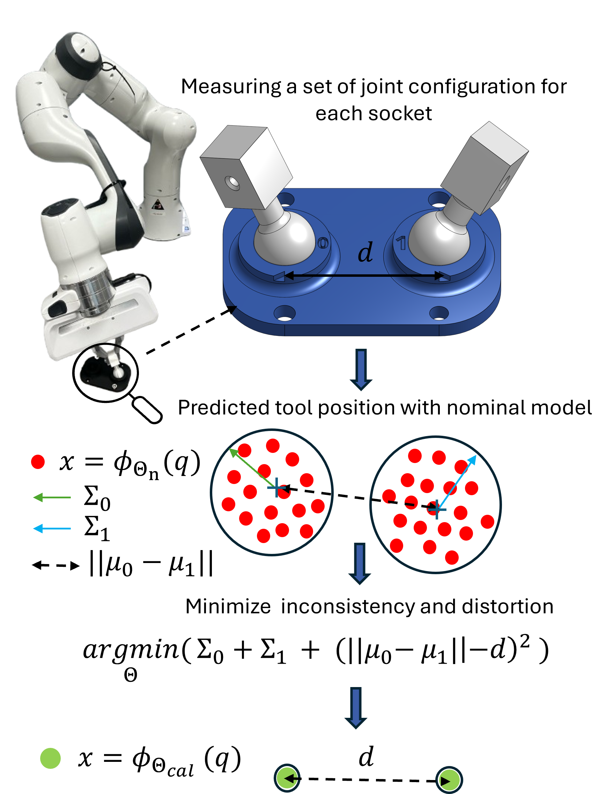
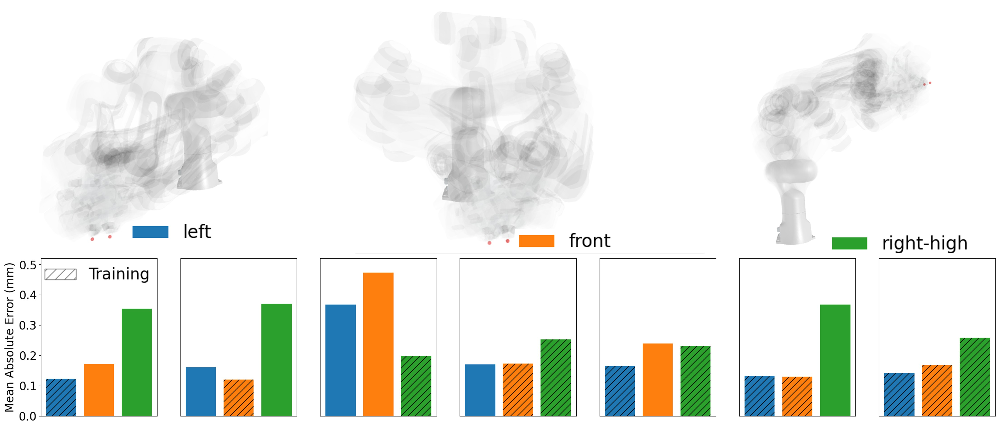
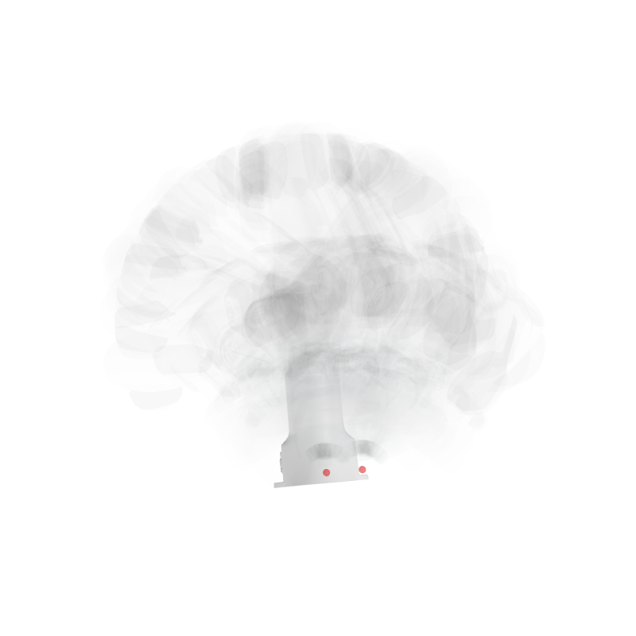
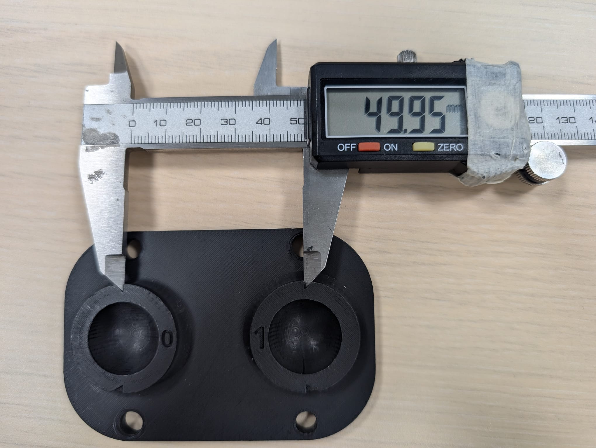
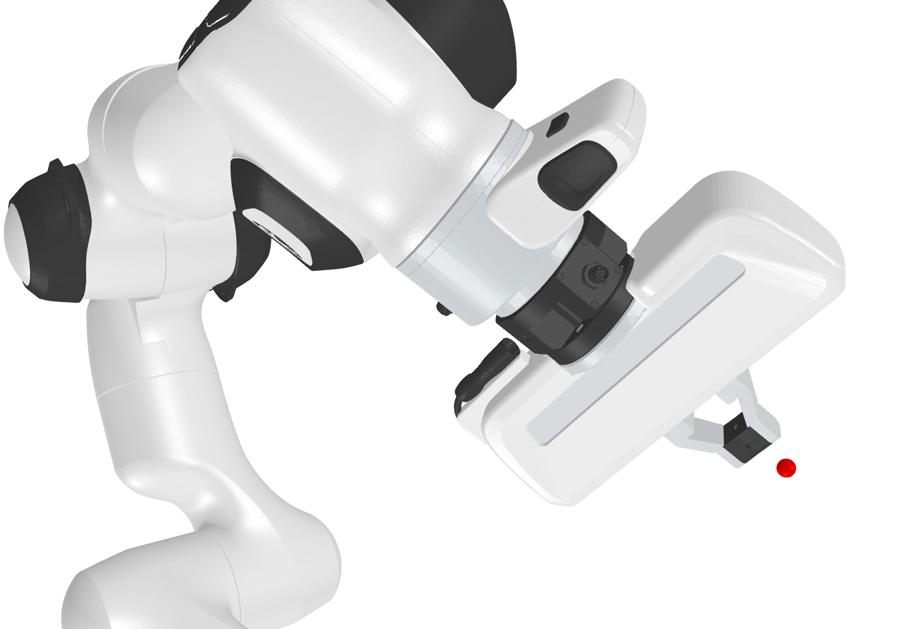

# MUKCa: Minimal User-friendly Kinematics Calibration of Robot Manipulators

Have you ever wondered why the accuracy of your robot is poor, and why the
end-effector is at different poses when you move in the null-space? Well, 
the platonics did! And we are you to help you out. This problem is especally 
relevant when working with cartesian control where an accurate forward kinematics is desirable. 

The method implemented in this repository was mainly developed for the Franka
Emika Panda robot, where inaccurate kinematics have been raised a few times but was tested on many other commercial robots. This is the first tool that does not require any external systems like optitrack, camera sensors or laser trackers. You will only need one simple tool to place in front of the robot. 
The tool is 3D printable and it is composed of two spherical sockets placed at a distance of 50 mm. A 3D printable spherical joint is then attached to the end effector and used to record many position of the robt in each of the sockets, identified as 0 and 1. 

The first step is the data recording and then the optimization is performed to optimize the robot urdf file. 

## What do we propose in this new approach? 
<!--  -->

The method contribution is the Minimalist and User-friendly Kinematics Calibration (MUKCa) available in the [stl/MUKCa_tool.stl](stl/MUKCa_tool.stl) folder, as the combination of an affordable calibration tool, illustrated in figure and
an optimization algorithm for kinematic parameter identification. The proposed minimalist tool is designed for accessibility and affordability, and it is 3D printable and composed of a sphere (or ball) with a two-socket base, as illustrated, without relying on external measurement systems or camera. After printing them, the calibration can immediately start with the data recording on the robot by simply placing the tool in front of the robot and the sphere attached to the end-effector. 

The two sockets are printed at a known distance, and the ball is printed to have the minimal possible play in the sockets. 

We propose a novel optimization routine. After collecting set of joint configurations for each socket, the calibration routine minimizes the variance of the predicted ball position for each of the two sockets, maximizing the model nullspace consistency.  Moreover, the model is optimized such that the distance among the average prediction matches the known distance between the two sockets, minimizing the model volumetric distortion. This consistency-and-distortion optimization is the first of its kind in the field of kinematic calibration. 

## Installation
This is a python package named calibrated_fk. 
Install the package through pip, using 
```bash
conda create -n kinematics_calibration python=3.10
conda activate kinematics_calibration
conda install -c conda-forge libstdcxx-ng=12
pip3 install -e .
pip install pynput
pip install panda-python
```

Or install the package through poetry, using
```bash
poetry install
```

## Record the data (ROS1)
To record the data, we rely on the ros topic that has the joint angles of the encoders. Place this repository in a catkin workspace and build it. 

```bash
cd ros_ws
catkin build
source devel/setup.{bash,zsh}
```
This will install the ros workspace to record data. It is only running one script to 
save joint states and writing a csv file. There is hardly any dependencies on this.
The calibration routine is very simple. The tool has two sockets identified as 0 and 1. There is a sphere attached at the end effecotor. The idea is to record main joint configuration of the ball in the socket 0 and many other in the socket 1. At least 20 for each socket. To do this we run the node in calibration_tools named record_joint_states_dataset. 


Here is an example for calibrating the kuka for example: 

```bash
rosrun calibration_tools record_joint_states_dataset --joint-state-topic-name /joint_states --robot-name kuka_1  --tool-position-on-table front --robot-dof 7 
```
For the robot name we advice to use the name of the robot and a number considering that you want to calibrate more than one robot with the same name. The position of the tool is to distinguish the different datasets if more one for different calibration tool are recorded.  
The ros topic /joint_states must be of type [sensor_msgs/JointState](https://docs.ros.org/en/noetic/api/sensor_msgs/html/msg/JointState.html). 

What to do when the code runs: 

- Press 'a' to add a new joint configuration that has the sphere in the socket that the displayed in the algorithm.  
- Presss 'd' to delete the last joint configuration from the list
- Press 's' when you switch the hole in which you are recording
- Press 'q' when you have finished recording. 


### Record data with a Franka (ROS1)


As controllers, we suggest to use the [Human Friendly Controllers](https://github.com/franzesegiovanni/franka_human_friendly_controllers.git). You can also lunch any controller of [franka_ros](https://github.com/frankaemika/franka_ros.git). It is important to check that the joint state can be echoed. 

When using a Franka, we give the possibility of using the buttons on the end effector to add data or switch between holes. 
Run the record_joint_states_panda node, e.g., 
```bash
rosrun calibration_tools record_joint_states_panda --joint-state-topic-name /joint_states --robot-name panda_1 --config-file panda_1.yaml --tool-position-on-table front 
```

- Press 'check' to add a data point
- Press 'down' to delete the last data point
- Press 'o' to switch between holes
- Press 'x' to save the data and quit.

You need to create a config file for the panda in 
'ros_ws/src/calibration_tools/config/<robot-name>' where you are specifying: hostname, username, password,that are the IP for the panda, the username and password used to access the Desk interface. 

### Record data with a Franka and Xarm6 (ROS2)
When using a Franka, we give the possibility of using the buttons on the end effector to add data or switch between holes. 
Run the record_joint_states_panda node, e.g., 
```bash
cd ros2_ws/scripts
python record_joint_states_panda.py --config-file panda.yaml --save_folder_name data_front
```
```bash
cd ros2_ws/scripts
python record_joint_states_xarm6.py --save_folder_name data_front
```

- Press 'check' to add a data point
- Press 'down' to delete the last data point
- Press 'o' to switch between holes
- Press 'x' to save the data and quit.

You need to create a config file for the panda in 
'ros2_ws/config' where you are specifying: hostname, username, password,that are the IP for the panda, the username and password used to access the Desk interface. 

## Calibrate the urdf model
We are ready to optimize our model. 

<!-- Make sure you have activated your virtual
environment if you use one (`source bin/activate`, `poetry shell`).  -->

Go to the
**scripts folder** and run  the optimization script.

```bash
cd scripts
```
Then you can run all the scripts as: 
```bash
python3 run_optimizer.py --model <nomial_urdf_name> --data <path/to/data/folder> 
```

The nomial model needs to be in the **urdf** folder. For example panda.urdf. The data are the one saved in the previous step. For example panda_1/front. 
This script runs the optimazation and prints the result. It outputs a new `urdf` model with the same name of the original one, e.g. panda.urdf but located in the **calibrated_urdf** folder and subfolder of the id that we gave to that robot, e.g. panda_1. So now if you browse to calibrated_urdf/panda_1 you will find your panda.urdf that contains calibrated parameters. 
```bash
python3 run_optimizer.py --model panda --data panda_1/front
``` 

Training on one position is sufficient but training on multiple tool position that are placed in different parts of the workspace, is as easy as specifying their path in the --data input, for example: 
```bash
python3 run_optimizer.py --model panda --data panda_1/front panda_1/left panda_1/right panda_1/high
``` 
The optimization will now try to maximize the consistency in any of the sockets of each tool and the bias in the predicted distance between the two sockets. 

In this plot we trained and evaluated on different positions of the tool or in all of them. You can see that even when training only on the front, the final accuracy on the right-high position, is still good. By training on all the position, the performace goes low everywhere. 
## Plot the learning curves
To diplay how good the model gets, we diplay the learning and the validation curves by running 

## Holiday Version (3 sockets)
```bash
python3 run_optimizer_holiday.py --model holiday_panda --data holiday_panda/data_A holiday_panda/data_B holiday_panda/data_C --root-link panda_link0 --offset-distance 0.0399 0.03992 0.03997 0.04 0.03993 0.03996
``` 
offset-distance: For each dataset, two inputs are required: the distance between hole1 and hole2, and the distance between hole2 and hole3.

```bash
python3 generate_learning_curve.py --model panda_1
```
This will display the consistency and the distortion of the model both on the training set but also in any other of the dataset that is in the folder data/panda_1. 
For example:
<p float="left">
  
  
</p>
The left curve is the consistency, i.e. the variance of the different forward kinematics positions for each of the two holes. The optimization is trying to make the robot consistent and less distorted as possible, that is why you see the curve to go down.
The right figure shows the distortion of the robot, i.e. the error in the distance between the two set of points for socket 0 ad socket 1. We exected the distance to be at 0.05 m, so we can compute the error of our measurement. 

## Evaluate a calibrated model on a particular dataset

You can evaluate the calibrated model

```bash
python3 compute_improved_performance.py  --model panda_1
```

The terminal will output the following statistics:

The mean absolute error  went from 8.28e-03 to 1.68e-04 on the train data on average
Percentage of removed error on train set: 97.97
The mean absolute error  went from 7.79e-03 to 3.47e-04 on the test data on average
Percentage of removed error on test set: 94.92

We can read that on the training set but also in the test set, 95 % of the consistency error was removed after the calibration. This makes the robot to be almost perfectly calibrated. 

### Visualize the overlay of the robot prediction
You can generate also an overlay of the robot in the different configurations that were recorded. For example 
```bash
python3 generate_overlay.py  --model panda_1 --data panda_1/front 
```
This will prompt a window with a visualization of the robot. Move the view such that you can nicely see the end-effector. Press q in the visualization window to save the camera setting with the point of view.
If you run the overlay again, you can also avoid to generate all the images of the poses. Just pass the flag --no-generate-images .

If the optimization was successful the overlay will look like this: 




You can notice that the forward kinematics is very consistent by the diplayed red dot of the learned shpere attached at the end effector. 

The overlay of the nominal uncalibrated model, will look more like this:


In this case, you can see that the forward kinematics is not consistent, as indicated by the scattered red dots of the learned sphere attached at the end effector.

### Use the panda urdf for a calibrated Cartesina impedance controller. 

You can use the [Franka human friendly controllers](https://github.com/franzesegiovanni/franka_human_friendly_controllers) and place the calibrated model in the urdf folder. To be sure to generate a compatible urdf model that will have the right paths specified, please run: 

```bash
python3 convert_panda_urdf.py -m panda_1
```
this will generated a **panda_calibrated.urdf** in the panda_1 folder. Copy this file in the controller repo ( in the urdf directory) and follow the instructions on how to start the controller using the calibrated external model. 

# Print the tool
We used a BambuLab A1. We printed with classic PLA, with the finest available settings, i.e. 0.08 mm. The printer is very precise, when measuring the distance between the socket using a caliper, it will have an error of less than 0.1 mm. This is very desirable considering that we are using that to calibrate. The tool has two pairs of notches to fit calibers. Usually calipers have an angles of 45 deg or 30 deg, check on which side it fits the best. Use a caliper with a resolution of at least 0.01 mm. If you see that the distance is between 40.90 and 50.10 mm, it means that the print is perfectly calibrated. Otherwsie, you can specify the distance you read in the optimization in meters. E.g.
python3 run_optimizer.py --model <nomial_urdf_name> --data <path/to/data/folder> --distance 0.0501
We always found the printed tool to be at (almost) perfect distance of 50 mm!


You can can remix the tools, I shared them in an [Onshape](https://cad.onshape.com/documents/0b6b115d8701048ec8c03433/w/dadf4b03313f5058948ebaa5/e/40893559aa99a64107618f54?renderMode=0&uiState=67e2e1d063975d2a0e09916f). 
# Try it with your robot and your own urdf! 
There are situations where for example you want to change the end effector position in the URDF or where you want to put a sensor between the last joint and the hand. 
This is an example we have in the lab in TU Delft with the bota sensor. 

- I created a new urdf file in the homonym folder with the sensor located in between the two joints. I called the file panda_plus_bota.urdf
- I also added the mesh in the homonym folder so I can visualize it 
- I create a file panda_plus_bota.yaml in config_optimizer where I specify all the joints that are going to be optimized. Each joint has xyz rpy variable optimized as transformation from the previous joint. For example I choose to optimize all the first 7 joints, the ball transformation and also the transformation of the sensor since I do not know the perfect dimension of the sensor. 
  - panda_joint1
  - panda_joint2
  - panda_joint3
  - panda_joint4
  - panda_joint5
  - panda_joint6
  - panda_joint7
  - bota_sensor_joint
  - ball_joint
- Record the data. As far as you have a joint_states topic, you can run the command describe at the beginning of this instructions. For example: 
```bash
rosrun calibration_tools record_joint_states_dataset --joint-state-topic-name joint_states --robot-name panda_with_sensor --tool-position-on-table front --robot-dof 7
```
This will save the data in the direction `data` with the name `panda_with_sensor\front`. Nice. 

- Let's optimize the urdf now: 
```
python3 generate_complete_analysis.py --model panda_plus_bota --data panda_1_with_sensor/front
```
This will generate an optimized file in `calibrated_urdf` in the subfolder `panda_with_sensor` named `panda_plus_bota.urdf`. So now you can take your old broken urdf and swap it with the new one.  

# Limitations 
The proposed method does not work for all the robots! Here is an example of performing the training on the kinova gen3lite robot. They do not have harmonic drives in each joint, hence they have more backlash. This is a problem, since we have uncertainty in the joint angles. Let's look at the bar plot before and after the training on different tool position. 

We can observe that training on the front brings the error down also on the left and on a position on the right (and higher) position of the tool. However, if we train only on the left, we observe overfitting, making the accuracy on the other position to decrease with respect to the orginal nominal model. For the kinova it is actually convenient to train on all the tool position. This brings the error down everywhere removoing the influence of the noisy joint reading. 

# Cite this work.
This new method is under review for publication.
You can cite it the preprint:
```
Franzese, G., Spahn, M., Kober, J. and Della Santina, C., 2025. MUKCa: Accurate and Affordable Cobot Calibration Without External Measurement Devices. arXiv preprint arXiv:2503.12584.
```
If you calibrated your URDF and used it in your research, and found it helpful, please reach out to Giovanni (g.franzese@tudelft.nl). If you are in a company and calibrate your robot using the MUKCa tool, please acknowledge it.

# Give feedback!

Any feedback on the usability, the method, and the results is appreciated and welcome! Let's make collaborative robots accurate together.