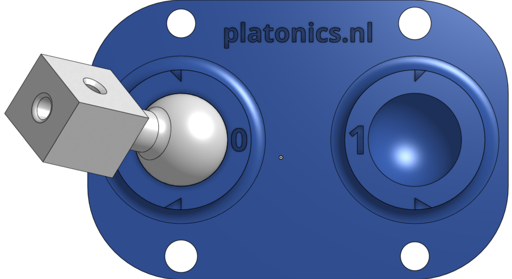
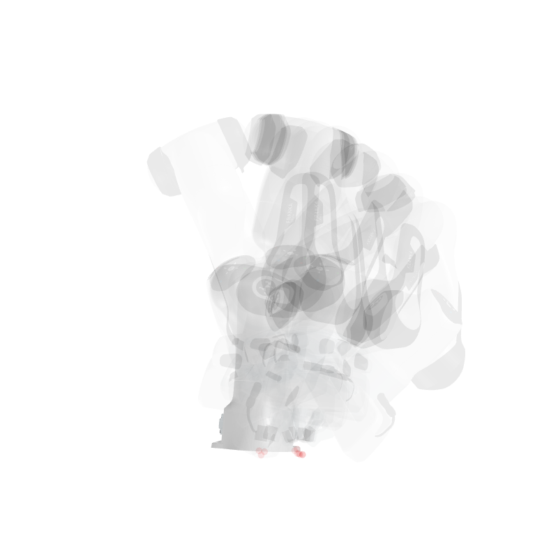

# MUKCa: Minimal User-friendly Kinematics Calibration of Robot Manipulators

Have you ever wondered why the accuracy of your robot is poor, and why the
end-effector is at different poses when you move in the null-space? Well, 
the platonics did! And we are you to help you out. This problem is especally 
relevant when working with cartesian control where an accurate forward kinematics is desirable. 

The method implemented in this repository was mainly developed for the Franka
Emika Panda robot, where inaccurate kinematics have been raised a few times but was tested on many other commercial robots. This is the first tool that does not require any external systems like optitrack, camera sensors or laser trackers. You will only need one simple tool to place in front of the robot. 
The tool is 3D printable and it is composed of two spherical sockets placed at a distance of 50 mm. A 3D printable spherical joint is then attached to the end effector and used to record many position of the robt in each of the sockets, identified as 0 and 1. 

The first step is the data recording and then the optimization is performed to optimize the robot urdf file. 

## Installation
This is a python package named calibrated_fk. 
Install the package through pip, using 
```bash
pip3 install -e .
```

Or install the package through poetry, using
```bash
poetry install
```
## Record the data


To record the data, we rely on the ros topic that has the joint angles of the encoders. Place this repository in a catkin workspace and build it. 

```bash
cd ros_ws
catkin build
source devel/setup.{bash,zsh}
```
This will install the ros workspace to record data. It is only running one script to 
save joint states and writing a csv file. There is hardly any dependencies on this.
The calibration routine is very simple. The tool has two sockets identified as 0 and 1. There is a sphere attached at the end effecotor. The idea is to record main joint configuration of the ball in the socket 0 and many other in the socket 1. At least 20 for each socket. To do this we run the node in calibration_tools named record_joint_states_dataset. 


Here is an example for calibrating the kuka for example: 

```bash
rosrun calibration_tools record_joint_states_dataset --joint-state-topic-name /joint_states --robot-name kuka_1  --tool-position-on-table front --robot-dof 7 
```
For the robot name we advice to use the name of the robot and a number considering that you want to calibrate more than one robot with the same name. The position of the tool is to distinguish the different datasets if more one for different calibration tool are recorded.  
The ros topic /joint_states must be of type [sensor_msgs/JointState](https://docs.ros.org/en/noetic/api/sensor_msgs/html/msg/JointState.html). 

What to do when the code runs: 

- Press 'a' to add a new joint configuration that has the sphere in the socket that the displayed in the algorithm.  
- Presss 'd' to delete the last joint configuration from the list
- Press 's' when you switch the hole in which you are recording
- Press 'q' when you have finished recording. 


### Record data with a Franka 


As controllers, we suggest to use the [Human Friendly Controllers](https://github.com/franzesegiovanni/franka_human_friendly_controllers.git). You can also lunch any controller of [franka_ros](https://github.com/frankaemika/franka_ros.git). It is important to check that the joint state can be echoed. 

When using a Franka, we give the possibility of using the buttons on the end effector to add data or switch between holes. 
Run the record_joint_states_panda node, e.g., 
```bash
rosrun calibration_tools record_joint_states_panda --joint-state-topic-name /joint_states --robot-name panda_1 --config-file panda_1.yaml --tool-position-on-table front 
```

- Press 'check' to add a data point
- Press 'down' to delete the last data point
- Press 'o' to switch between holes
- Press 'x' to save the data and quit.

You need to create a config file for the panda in 
'ros_ws/src/calibration_tools/config/<robot-name>' where you are specifying: hostname, username, password,that are the IP for the panda, the username and password used to access the Desk interface. 

## Calibrate the urdf model
We are ready to optimize our model. 

<!-- Make sure you have activated your virtual
environment if you use one (`source bin/activate`, `poetry shell`).  -->

Go to the
**scripts folder** and run  the optimization script.

```bash
cd scripts
```
Then you can run all the scripts as: 
```bash
python3 run_optimizer.py --model <nomial_urdf_name> --data <path/to/data/folder> 
```

The nomial model needs to be in the **urdf** folder. For example panda.urdf. The data are the one saved in the previous step. For example panda_1/front. 
This script runs the optimazation and prints the result. It outputs a new `urdf` model with the same name of the original one, e.g. panda.urdf but located in the **calibrated_urdf** folder and subfolder of the id that we gave to that robot, e.g. panda_1. So now if you browse to calibrated_urdf/panda_1 you will find your panda.urdf that contains calibrated parameters. 
```bash
python3 run_optimizer.py --model panda --data panda_1/front
``` 

## Plot the learning curves
To diplay how good the model gets, we diplay the learning and the validation curves by running 

```bash
python3 generate_learning_curve.py --model panda_1
```
This will display the consistency and the distortion of the model both on the training set but also in any other of the dataset that is in the folder data/panda_1. 
For example:
<p float="left">
  
  
</p>
The left curve is the consistency, i.e. the variance of the different forward kinematics positions for each of the two holes. The optimization is trying to make the robot consistent and less distorted as possible, that is why you see the curve to go down.
The right figure shows the distortion of the robot, i.e. the error in the distance between the two set of points for socket 0 ad socket 1. We exected the distance to be at 0.05 m, so we can compute the error of our measurement. 

## Evaluate a calibrated model on a particular dataset

You can evaluate the calibrated model on any dataset that you recorded for that robot

```bash
python3 eval_model.py --model <calibrated_model> --data <path/to/data/folder> 
```
For example, 

```bash
python3 eval_model.py  --model panda_1 --data panda_1/front
```

You will get some numbers as outputs:
- 'distance_error': 2.01384625872561e-05,
- 'height_error': 0.00013234018119939392,
- 'mean_1': array([ 0.47548193, -0.20020225,  0.01592467]),
- 'mean_2': array([ 0.4757642 , -0.15022336,  0.01579233]),
- 'std_dev_1': 0.00027288376639481986,
- 'std_dev_2': 0.00028558583889686857,
- 'std_dev_fk': 0.00039499977384835393

You can also show the improved performance from the original nominal model to the obtained calibrated model. 

```bash
python3 compute_improved_performance.py  --model panda_1
```

The terminal will output the following statistics:

- The consistency went from 1.2716E-02 to 2.3783E-04 on the training data
- The distortion went from 4.3804E-03 to 2.2794E-06 on the training data
- The consistency went from 1.3118E-02 to 5.3291E-04 on the test data on average
- The distortion went from 2.4071E-03 to 1.6866E-04 on the test data on average
Percentage of removed error on training set: 98.12971564632001
- Percentage of removed distortion error on training set: 99.94796380540399
- Percentage of removed error on test set: 95.93608375730201
- Percentage of removed distortion error on test set 83.80232142397945

We can read the on the training set but also in the test set, 95 % of the consistency error was removed after the calibration. This makes the robot to be almost perfectly calibrated. 

### Visualize the overlay of the robot prediction
You can generate also an overlay of the robot in the different configurations that were recorded. For example 
```bash
python3 generate_overlay.py  --model panda_1 --data panda_1/front 
```
This will prompt a window with a visualization of the robot. Move the view such that you can nicely see the end-effector. Press q in the visualization window to save the camera setting with the point of view.
If you run the overlay again, you can also avoid to generate all the images of the poses. Just pass the flag --no-generate-images .

If the optimization was successful the overlay will look like this: 


You can notice that the forward kinematics is very consistent by the diplayed red dot of the learned shpere attached at the end effector. 

The overlay of the nominal uncalibrated model, will look more like this:



In this case, you can see that the forward kinematics is not consistent, as indicated by the scattered red dots of the learned sphere attached at the end effector.

### Use the panda urdf for a calibrated Cartesina impedance controller. 

You can use the [Franka human friendly controllers](https://github.com/franzesegiovanni/franka_human_friendly_controllers) and place the calibrated model in the urdf folder. To be sure to generate a compatible urdf model that will have the right paths specified, please run: 

```bash
python3 convert_panda_urdf.py -m panda_1
```
this will generated a **panda_calibrated.urdf** in the panda_1 folder. Copy this file in the controller repo ( in the urdf directory) and follow the instructions on how to start the controller using the calibrated external model. 